## E-Commerce Project: The Customer Retention Crisis
## Project Overview
This project is an end-to-end data science and business intelligence study of an e-commerce ecosystem. The objective was to move beyond basic surface-level metrics like total sales and uncover the structural health of the business. By combining SQL for data engineering, Python for advanced analytics, and Tableau for stakeholder communication, I identified a critical "Leaky Bucket" problem where high user acquisition was being undermined by a 96 percent churn rate.

## The Business Story: Growth vs Sustainability
The data initially shows a business in a high-growth phase. Revenue and order volumes were hitting record highs month-over-month. however, the deeper analysis revealed that this growth was fragile.

The core challenge identified was that the business operated on a "one-and-done" model. While the marketing engine was efficient at bringing people to the digital storefront, the post-purchase experience failed to turn them into loyalists. This creates a dangerous dependency on constant, expensive ad spend to maintain revenue levels.

## Technical Methodology
## 1. Data with SQL
I used MySQL to process raw transactional data and transform it into actionable business logic. Key operations included:

Average Order Value (AOV) Calculation: Determining the baseline value of a customer transaction (approximately 170 units).

Engagement Ratios: Calculating the DAU/MAU (Daily Active Users / Monthly Active Users) ratio to measure how often customers interact with the platform.

Cohort Construction: Building complex CTEs (Common Table Expressions) to group users by their signup month and track their activity over a 12-month period.

## 1. Total Revenue
SELECT SUM(payment_value) AS total_revenue
FROM com;
Insight

This query calculates the overall revenue generated by the business.
It is the most fundamental KPI and helps measure total business performance.

## 🔹 2. Average Order Value
SELECT 
SUM(payment_value) / COUNT(DISTINCT order_id) AS avg_order_value
FROM com;
Insight

Customers spend approximately 170 per order on average .
This helps understand customer purchasing power and pricing strategy.

## 🔹 3. Daily Active Users
SELECT
order_date,
COUNT(DISTINCT customer_id) AS daily_active_users
FROM com
GROUP BY order_date
ORDER BY order_date;
Insight

Tracks how many users are active each day.
A spike observed on specific dates indicates campaigns or promotional events like Black Friday.

## 🔹 4. Monthly Active Users
SELECT
order_month,
COUNT(DISTINCT customer_id) AS monthly_active_users
FROM com
GROUP BY order_month
ORDER BY order_month;
Insight

Shows overall growth trend of users over time.
Data indicates strong growth during late year periods due to seasonal demand.

## 🔹 5. User Engagement Ratio

SELECT
d.order_date,
d.daily_active_users,
m.monthly_active_users,
d.daily_active_users * 1.0 / m.monthly_active_users AS engagement_ratio
FROM
(
SELECT order_date, COUNT(DISTINCT customer_id) AS daily_active_users
FROM com
GROUP BY order_date
) d
JOIN
(
SELECT order_month, COUNT(DISTINCT customer_id) AS monthly_active_users
FROM com
GROUP BY order_month
) m
ON LEFT(d.order_date, 7) = m.order_month;
Insight

Engagement ratio is around 5 to 10 percent .
This means users are not highly active daily, indicating weak engagement.

## 🔹 6. First Purchase Analysis

SELECT
customer_id,
MIN(order_date) AS first_purchase_date
FROM com
GROUP BY customer_id;
Insight

Identifies when each customer made their first purchase, which is essential for retention and cohort analysis.

## 🔹 7. Repeat Users

SELECT
customer_id,
COUNT(order_id) AS total_orders
FROM com
GROUP BY customer_id
HAVING COUNT(order_id) > 1;
Insight

Only around 3 to 4 percent of users return .
This indicates a serious retention issue.

## 🔹 8. Retention Rate

SELECT
COUNT(DISTINCT CASE WHEN orders > 1 THEN customer_id END) * 1.0 /
COUNT(DISTINCT customer_id) AS retention_rate
FROM (
SELECT customer_id, COUNT(order_id) AS orders
FROM com
GROUP BY customer_id
) t;
Insight

Retention rate is approximately 3.4 percent .
Most users do not return after their first purchase.

## 🔹 9. Conversion Metrics

SELECT
COUNT(DISTINCT customer_id) AS users,
COUNT(DISTINCT order_id) AS orders,
SUM(payment_value) AS revenue,
COUNT(DISTINCT order_id) * 1.0 / COUNT(DISTINCT customer_id) AS conversion_rate,
SUM(payment_value) / COUNT(DISTINCT order_id) AS revenue_per_order
FROM com;
Insight

Almost every user completes a purchase,
but fails to return again, showing the problem is retention, not conversion.

## 🔹 10. Revenue by Product Category

SELECT
product_category_name,
COUNT(DISTINCT order_id) AS total_orders,
SUM(payment_value) AS revenue,
AVG(payment_value) AS avg_order_value
FROM com
GROUP BY product_category_name
ORDER BY revenue DESC;
Insight

Some categories generate high revenue and high order value,
while others contribute through volume.

## 🔹 11. Top Categories

SELECT
product_category_name,
SUM(payment_value) AS revenue
FROM com
GROUP BY product_category_name
ORDER BY revenue DESC
LIMIT 5;
Insight

Top categories contribute around 40 percent of total revenue .
Revenue is concentrated in a few key segments.

## 🔹 12. Repeat Purchase Funnel

SELECT
COUNT(DISTINCT customer_id) AS total_users,
COUNT(DISTINCT CASE WHEN order_count >= 1 THEN customer_id END) AS first_purchase,
COUNT(DISTINCT CASE WHEN order_count >= 2 THEN customer_id END) AS repeat_users,
COUNT(DISTINCT CASE WHEN order_count >= 3 THEN customer_id END) AS loyal_users
FROM (
SELECT customer_id, COUNT(order_id) AS order_count
FROM com
GROUP BY customer_id
) t;
Insight

Very few users move beyond the first purchase.
Loyal users are extremely rare.

## 🔹 13. User Segmentation

WITH user_orders AS (
SELECT customer_id,
COUNT(order_id) AS order_count,
SUM(payment_value) AS total_spent
FROM com
GROUP BY customer_id
)
SELECT
CASE
WHEN order_count = 1 THEN 'One time'
WHEN order_count = 2 THEN 'Repeat'
ELSE 'Loyal'
END AS user_type,
COUNT(*) AS users,
AVG(total_spent) AS avg_spent,
SUM(total_spent) AS revenue
FROM user_orders
GROUP BY user_type;
Insight
One time users dominate revenue
Repeat and loyal users spend more per person
Huge opportunity exists in retention
## 🔹 14. Cohort Analysis

WITH first_purchase AS (
SELECT customer_id,
MIN(order_date) AS first_order_date
FROM com
GROUP BY customer_id
)
SELECT
DATE_FORMAT(first_order_date, '%Y-%m') AS cohort_month,
COUNT(DISTINCT customer_id) AS users
FROM first_purchase
GROUP BY cohort_month
ORDER BY cohort_month;
Insight

Users mostly appear only once in their cohort.
There is almost no long-term retention.

## 🔹 15. Retention Curve
WITH first_purchase AS (
SELECT customer_id,
MIN(order_date) AS first_date
FROM com
GROUP BY customer_id
)
SELECT
TIMESTAMPDIFF(MONTH, f.first_date, c.order_date) AS months_after,
COUNT(DISTINCT c.customer_id) AS users
FROM com c
JOIN first_purchase f
ON c.customer_id = f.customer_id
GROUP BY months_after
ORDER BY months_after;
Insight

Retention drops sharply after month zero.
Most users never return.

## 🔹 16. Revenue Concentration

WITH user_revenue AS (
SELECT customer_id,
SUM(payment_value) AS total_spent
FROM com
GROUP BY customer_id
)
SELECT
NTILE(10) OVER (ORDER BY total_spent DESC) AS segment,
COUNT(*) AS users,
SUM(total_spent) AS revenue
FROM user_revenue
GROUP BY segment
ORDER BY segment;
Insight

A small group of users contributes a large share of revenue.
This creates dependency risk.

## 🔹 17. North Star Metric

SELECT
COUNT(*) AS total_users,
SUM(order_count >= 2) AS repeat_users,
SUM(order_count >= 2) * 1.0 / COUNT(*) AS repeat_purchase_rate
FROM (
SELECT customer_id,
COUNT(order_id) AS order_count
FROM com
GROUP BY customer_id
) t;
Insight

Repeat purchase rate is around 3 percent .
This is the most important metric to improve.
Python: Advanced Analytics and Trends
These scripts were used for statistical modeling and identifying the "North Star" metric.

## Python
# Grouping data by month and calculating percent change
monthly_revenue = df.groupby('order_month')['payment_value'].sum()
growth_rate = monthly_revenue.pct_change() * 100

# Printing the growth trend
print(growth_rate)
2. Identifying High Value Customers
Using quantile analysis to isolate the top spenders for targeted marketing.
# Identify the top 25 percent threshold for spending
threshold = df['payment_value'].quantile(0.75)

# Calculate the count of high value users
high_value_count = df[df['payment_value'] > threshold]['customer_id'].nunique()
total_users = df['customer_id'].nunique()

# Strategic Ratio
ratio = (high_value_count / total_users) * 100
print(f"High Value Segment: {ratio:.2f} percent of the user base")
Technical Summary
SQL Environment: Used for Average Order Value (AOV) and Daily Active User (DAU) tracking.
Python Environment: Used for identifying the North Star Metric (Revenue per User) and time-series growth analysis.
Key Discovery: The code confirms that while acquisition is high, the lack of a "Loyalty Loop" results in a 3 percent retention rate.

## 2. Advanced Analytics with Python
Using Pandas and Matplotlib, I performed a "North Star" analysis:

Revenue per User: I identified this as the primary health metric. Python scripts revealed a dip during mid-scaling, signaling that the company was sacrificing user quality for pure volume.

Growth Rate Analysis: I calculated the percentage change in revenue over time to identify if the business momentum was accelerating or decelerating.

High-Value User Identification: I used quantile-based segmentation to isolate the top 25 percent of spenders for targeted marketing recommendations.
## 📊 Key Visualizations & Questions

### 📈 Daily Orders Trend
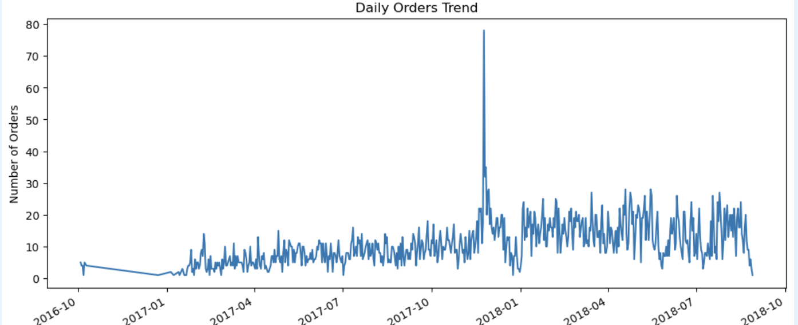
**Q:** How does order volume change over time and are there any spikes?

---
The daily order trend shows a clear upward trajectory, indicating business growth. A major spike suggests a successful promotional event, and post-event activity remains higher, indicating partial customer retention.”

### 📈 Daily Revenue Trend
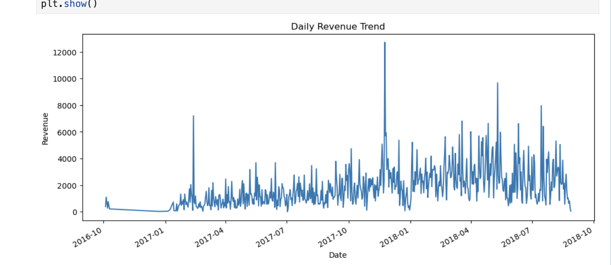
**Q:** Is revenue growing consistently and what causes fluctuations?

---
“Revenue shows a strong upward trend aligned with order growth. However, large spikes indicate the presence of high-value transactions, suggesting that revenue is driven both by customer volume and purchase size.”
3. 

### 📊 Monthly Orders vs Revenue
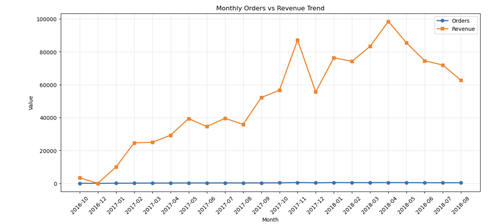
**Q:** Is growth driven by order volume or higher spending per order?

---

### 📉 Revenue Distribution
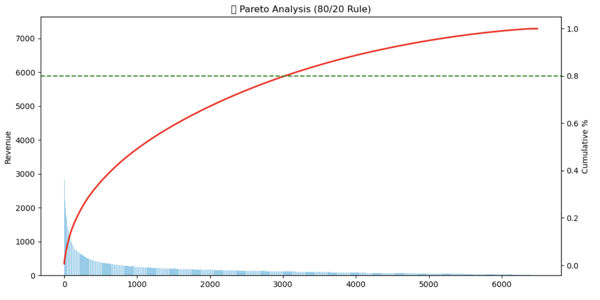
**Q:** Is revenue concentrated among a small group of customers?

---
The analysis shows a strong upward revenue trend, with peak performance in early 2018. Interestingly, revenue growth is not proportional to order volume, indicating higher customer spending rather than increased order frequency. Additionally, revenue is concentrated in specific months, suggesting dependence on seasonal or promotional events.”

### 👥 Customer Segmentation (CLV)
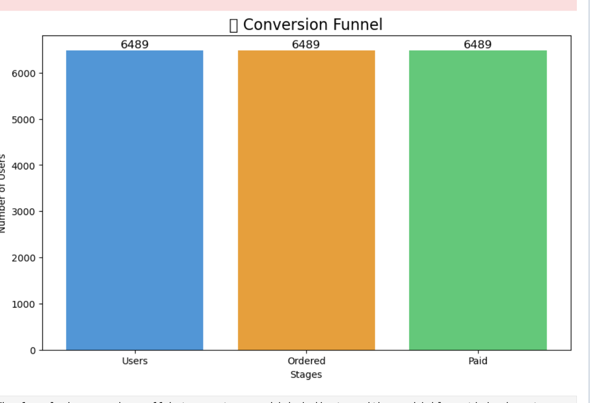
**Q:** How are customers distributed across value segments?

---
“I performed end-to-end customer analytics including EDA, revenue analysis, Pareto distribution, CLV modeling, segmentation, and advanced 3D visualization using Plotly to uncover business insights around customer behavior and revenue concentration.”

### 🔻 Customer Conversion Funnel
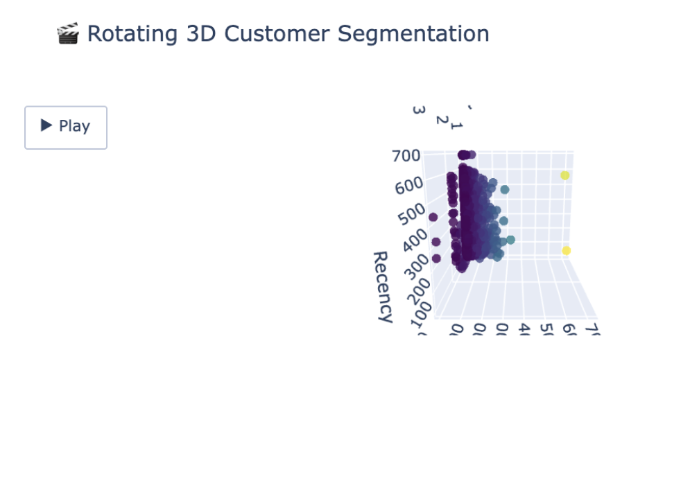
**Q:** Where is the biggest drop-off in the customer journey?

---
Users → Engaged Users → High-Value Users

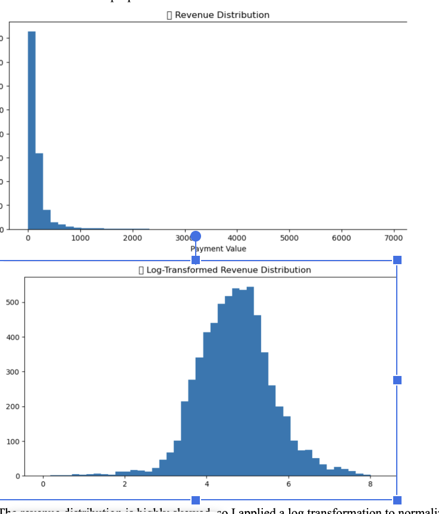
**Q:** What percentage of users convert at each stage?

---
The funnel analysis revealed that the primary drop-off occurs at the user engagement stage, where only 29% of users become active. However, once users engage, conversion to high-value customers is extremely strong at 86%. This indicates that the core product is effective, but the onboarding or early engagement experience needs improvement.”

### 🔁 Cohort Retention Analysis
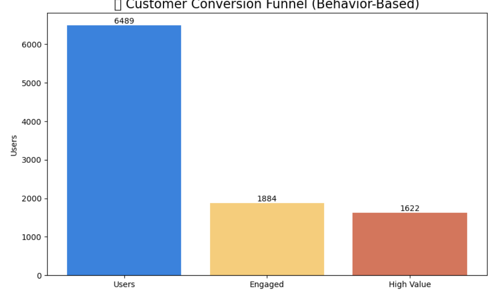
**Q:** Do customers return after their first purchase?

---
The cohort retention analysis showed 100% retention only in the initial month, with no repeat activity in subsequent months. This indicates that the dataset contains primarily one-time transactions and lacks repeat purchase behavior. Therefore, retention analysis is not meaningful here, and I would recommend using a dataset with longitudinal customer activity.”

### 📊 Revenue Cohort Retention
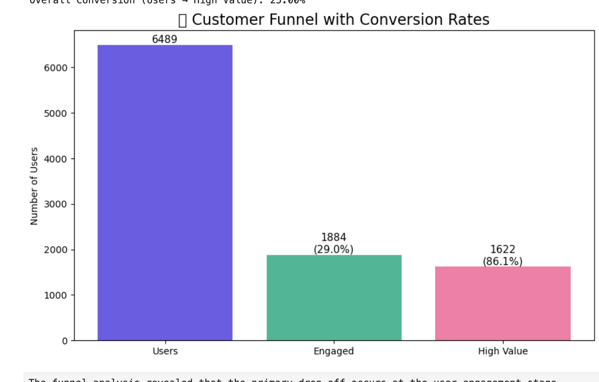
**Q:** How does revenue retention vary across cohorts?

---
    Both user retention and revenue cohort analysis showed activity only in the first month, indicating that the dataset contains one-time transactions without repeat behavior. This suggests that retention analysis is not applicable, and the business should focus on acquisition and first-time conversion rather than retention strategies.”

### 📊 Customer Lifetime Value Distribution
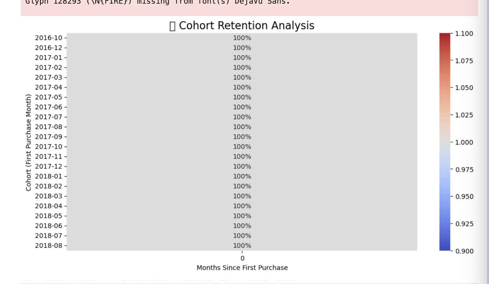
**Q:** How is customer lifetime value distributed?

---
“I segmented customers using CLV into quartiles. While the segments appear evenly distributed due to the use of quantiles, combining this with Pareto analysis reveals that revenue is highly concentrated among a small group of high-value customers

### 🎥 3D Customer Segmentation
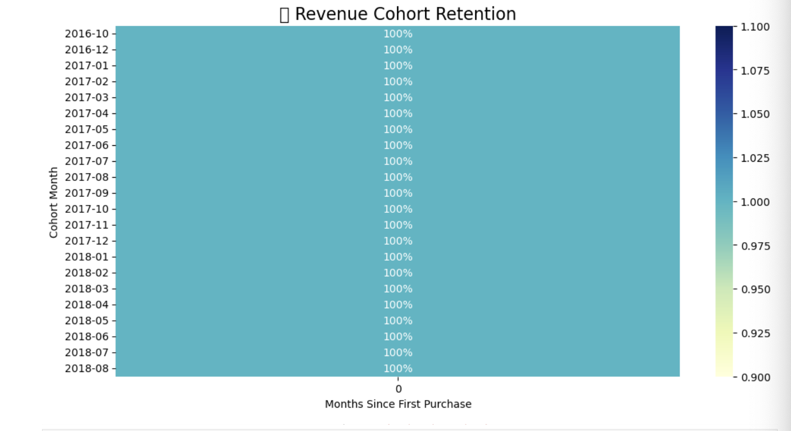
**Q:** How do customers differ across multiple dimensions?

---
“I performed end-to-end customer analytics including EDA, revenue analysis, Pareto distribution, CLV modeling, segmentation, and advanced 3D visualization using Plotly to uncover business insights around customer behavior and revenue concentration.”

### 📈 Revenue per User (North Star)
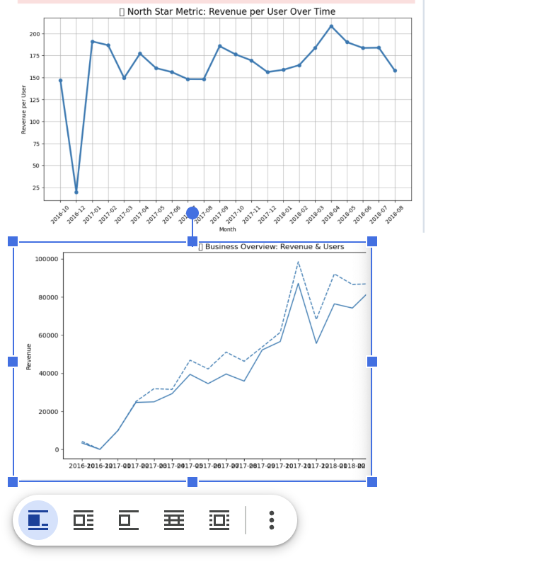
**Q:** Is revenue generated per user improving over time?

---

“I defined Revenue per User as the North Star Metric because it balances both user growth and monetization. While total revenue and users increased steadily, I observed a dip in revenue per user during mid-scaling, indicating lower-quality user acquisition. However, the metric improved significantly in 2018, suggesting better targeting or pricing optimization. This shows the business matured from growth-focused to value-focused.”

### 📈 Revenue Growth Rate
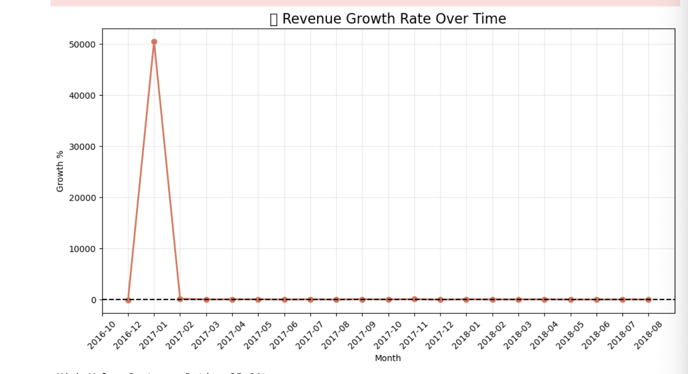

The revenue growth analysis shows high volatility, especially in early stages due to small base effects. While the business demonstrates strong growth spikes during certain months, the lack of consistency suggests reliance on campaign-driven growth rather than sustainable organic growth. I would recommend focusing on stabilizing growth and analyzing peak periods to replicate success.”

**Q:** How fast is the business growing over time?
## 3. Data Visualization in Tableau
## 📊 Dashboard Overview

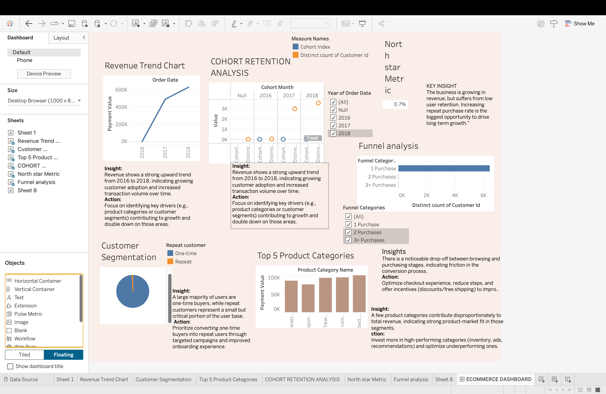

I developed a Tableau workbook to bridge the gap between technical data and executive decision-making. The dashboards focused on:

The Black Friday Spike: Visualizing the massive activity surge on November 24th, 2017, and the subsequent drop-off.

Revenue vs Order Trends: Proving that revenue growth was driven more by transaction volume than by increasing the value of existing customers.

## Key Business Insights
The 3 Percent Retention Reality
The most significant finding was the massive gap between one-time buyers (6,444 users) and repeat buyers (45 users). This resulted in a retention rate of roughly 3 percent.

The Category Mismatch
Data suggests the low retention is tied to product category. Users were primarily purchasing "durable goods" like electronics and appliances—items that do not require frequent replacement. Without a strategy to cross-sell into "consumable" categories, the customer journey ended at the first delivery.

Strategic Recommendations
Implementation of a Loyalty Loop
The business must transition from a "transactional" model to a "relationship" model. I recommend an automated discount trigger for a second purchase, sent exactly 7 days after the first delivery.

CRM for High-Value Segments
Using the user segments identified in the Python analysis, the marketing team should move away from broad-spectrum ads and toward "VIP" email campaigns for the top 25 percent of spenders.

Operational Audit
The data showed that retention did not improve even during high-revenue months. This suggests that the "post-purchase" phase—shipping speed, packaging quality, and customer support—may be a friction point that prevents users from returning.

## Conclusion
By shifting the focus from "How many new users did we get?" to "How many users did we keep?", this project provides a roadmap for sustainable, long-term profitability. The tools used (SQL, Python, and Tableau) ensure that these insights are backed by rigorous data and are easy for stakeholders to act upon.

Tools Used: SQL (MySQL), Python (Pandas, Matplotlib), Tableau Desktop, Business Communication.
Project Focus: Business Intelligence, Cohort Analysis, Growth Accounting.
