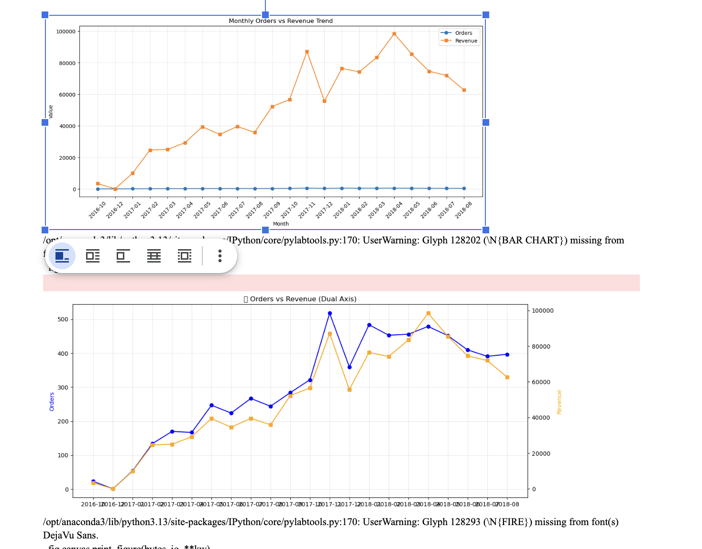
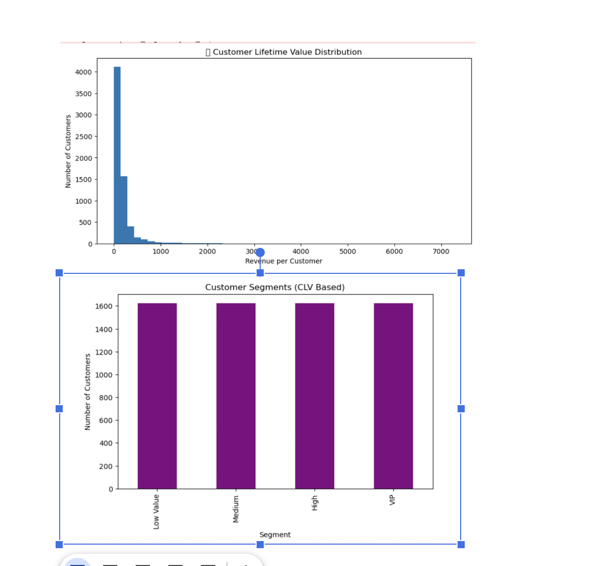

E-Commerce Project: The Customer Retention Crisis
Project Overview
This project is an end-to-end data science and business intelligence study of an e-commerce ecosystem. The objective was to move beyond basic surface-level metrics like total sales and uncover the structural health of the business. By combining SQL for data engineering, Python for advanced analytics, and Tableau for stakeholder communication, I identified a critical "Leaky Bucket" problem where high user acquisition was being undermined by a 96 percent churn rate.

The Business Story: Growth vs Sustainability
The data initially shows a business in a high-growth phase. Revenue and order volumes were hitting record highs month-over-month. however, the deeper analysis revealed that this growth was fragile.

The core challenge identified was that the business operated on a "one-and-done" model. While the marketing engine was efficient at bringing people to the digital storefront, the post-purchase experience failed to turn them into loyalists. This creates a dangerous dependency on constant, expensive ad spend to maintain revenue levels.

Technical Methodology
1. Data with SQL
I used MySQL to process raw transactional data and transform it into actionable business logic. Key operations included:

Average Order Value (AOV) Calculation: Determining the baseline value of a customer transaction (approximately 170 units).

Engagement Ratios: Calculating the DAU/MAU (Daily Active Users / Monthly Active Users) ratio to measure how often customers interact with the platform.

Cohort Construction: Building complex CTEs (Common Table Expressions) to group users by their signup month and track their activity over a 12-month period.

2. Advanced Analytics with Python
Using Pandas and Matplotlib, I performed a "North Star" analysis:

Revenue per User: I identified this as the primary health metric. Python scripts revealed a dip during mid-scaling, signaling that the company was sacrificing user quality for pure volume.

Growth Rate Analysis: I calculated the percentage change in revenue over time to identify if the business momentum was accelerating or decelerating.

High-Value User Identification: I used quantile-based segmentation to isolate the top 25 percent of spenders for targeted marketing recommendations.
## 📊 Key Visualizations & Questions

### 📈 Daily Orders Trend

**Q:** How does order volume change over time and are there any spikes?

---

### 📈 Daily Revenue Trend

**Q:** Is revenue growing consistently and what causes fluctuations?

---

### 📊 Monthly Orders vs Revenue

**Q:** Is growth driven by order volume or higher spending per order?

---

### 📉 Revenue Distribution

**Q:** Is revenue concentrated among a small group of customers?

---

### 📉 Log Revenue Distribution

**Q:** Does log transformation reveal hidden patterns in revenue?

---

### 📊 Pareto Analysis (80/20)

**Q:** Do a small percentage of customers contribute most of the revenue?

---

### 👥 Customer Segmentation (CLV)

**Q:** How are customers distributed across value segments?

---

### 🔻 Customer Conversion Funnel

**Q:** Where is the biggest drop-off in the customer journey?

---

### 🔻 Funnel with Conversion Rates

**Q:** What percentage of users convert at each stage?

---

### 🔁 Cohort Retention Analysis

**Q:** Do customers return after their first purchase?

---

### 📊 Revenue Cohort Retention

**Q:** How does revenue retention vary across cohorts?

---

### 📊 Customer Lifetime Value Distribution

**Q:** How is customer lifetime value distributed?

---

### 🎥 3D Customer Segmentation

**Q:** How do customers differ across multiple dimensions?

---

### 📈 Revenue per User (North Star)

**Q:** Is revenue generated per user improving over time?

---

### 📈 Revenue Growth Rate

**Q:** How fast is the business growing over time?
3. Data Visualization in Tableau
I developed a Tableau workbook to bridge the gap between technical data and executive decision-making. The dashboards focused on:

The Black Friday Spike: Visualizing the massive activity surge on November 24th, 2017, and the subsequent drop-off.

Revenue vs Order Trends: Proving that revenue growth was driven more by transaction volume than by increasing the value of existing customers.

Key Business Insights
The 3 Percent Retention Reality
The most significant finding was the massive gap between one-time buyers (6,444 users) and repeat buyers (45 users). This resulted in a retention rate of roughly 3 percent.

The Category Mismatch
Data suggests the low retention is tied to product category. Users were primarily purchasing "durable goods" like electronics and appliances—items that do not require frequent replacement. Without a strategy to cross-sell into "consumable" categories, the customer journey ended at the first delivery.

Strategic Recommendations
Implementation of a Loyalty Loop
The business must transition from a "transactional" model to a "relationship" model. I recommend an automated discount trigger for a second purchase, sent exactly 7 days after the first delivery.

CRM for High-Value Segments
Using the user segments identified in the Python analysis, the marketing team should move away from broad-spectrum ads and toward "VIP" email campaigns for the top 25 percent of spenders.

Operational Audit
The data showed that retention did not improve even during high-revenue months. This suggests that the "post-purchase" phase—shipping speed, packaging quality, and customer support—may be a friction point that prevents users from returning.

Conclusion
By shifting the focus from "How many new users did we get?" to "How many users did we keep?", this project provides a roadmap for sustainable, long-term profitability. The tools used (SQL, Python, and Tableau) ensure that these insights are backed by rigorous data and are easy for stakeholders to act upon.

Tools Used: SQL (MySQL), Python (Pandas, Matplotlib), Tableau Desktop, Business Communication.
Project Focus: Business Intelligence, Cohort Analysis, Growth Accounting.
